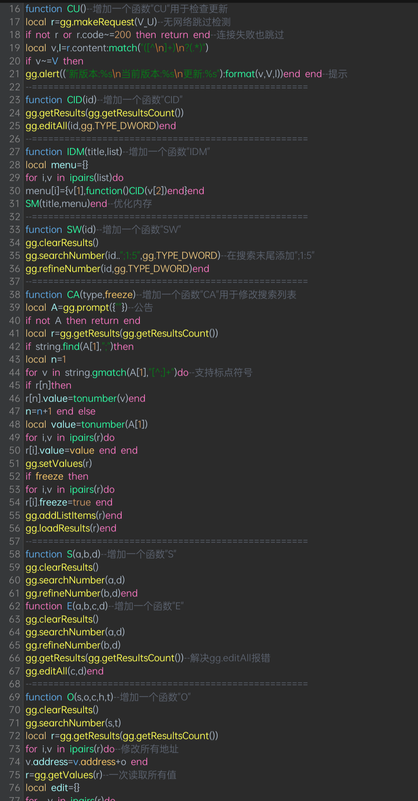
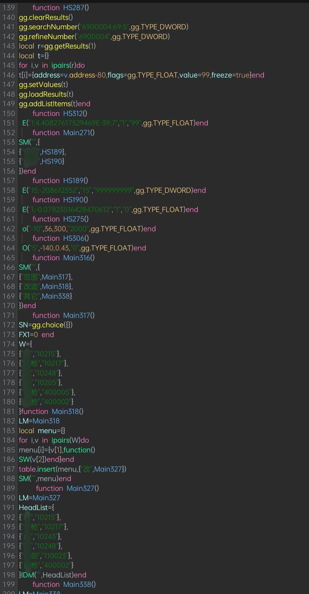

# GG Lua语法高亮文件/GameGuardian Lua Pro Syntax

适用于 MT管理器夜间主题 的 GameGuardian Lua 语法高亮。
GameGuardian Lua Pro Syntax is a syntax highlighting file for GameGuardian Lua scripts in MT Manager dark mode.

## 特性/Features

- Lua关键字高亮
  Lua keyword highlighting

- 函数定义/调用区分
  Distinguish function definitions and function calls
 
- GG API高亮
  GameGuardian API highlighting

- gg.TYPE_* 常量分类
  gg.TYPE_* constant highlighting

- gg.REGION_* 分类
  gg.REGION_* constant highlighting

- gg.SIGN_* 分类
  gg.SIGN_* constant highlighting

- gg.PROT_* 分类
  gg.PROT_* constant highlighting

- GG POINTER 分类
  GG POINTER constant highlighting

- GG搜索数字串高亮
  GG search number pattern highlighting

- 作者/版本注释高亮
  Author and version comment highlighting

## 安装/Installation

### 中文

1. 下载 GameGuardian_Lua_Pro.mtsx
2. 使用 MT管理器打开
3. 点击该文件
4. 选择安装语法文件
5. Lua 文件选择该语法

### English

1. Download `GameGuardian_Lua_Pro.mtsx`
2. Open the file with MT Manager
3. Tap the file
4. Select "Install Syntax File"
5. Select this syntax for Lua files

## 图片/Preview

